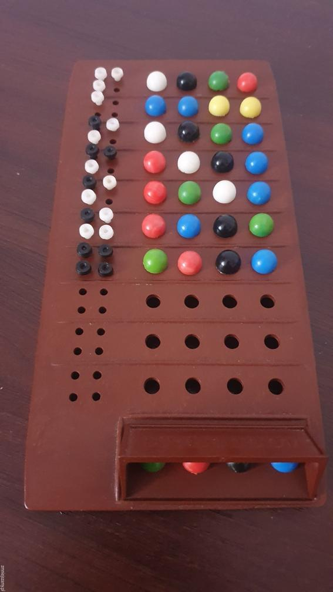

## LOGOGRAM - znana jako "Mastermind"
 
Kolor czarny został w grze zastąpiony kolorem 'Violet', aby nie powtarzały się inicjały kolorów "Black" i "Blue".

### Wymagane biblioteki:
* colorama==0.4.6

### Opis gry:
- Program losuje 4 grzybki o różnych kolorach w określonej kolejności. 
- Zadaniem gracza jest odgadnięcie kolorów grzybków w odpowiedniej kolejności. 
- Kolory mogą się powtarzać. 
- Gracz ma 10 szans na odgadnięcie ustawienia. 
- Ocena każdej tury jest wyświetlana po prawej stronie np. 2 - 1. 
- Pierwsza cyfra oznacza ile grzybków jest poprawnie wytypowanych, a druga ile jest grzybków o odpowiednim kolorze ale stojące na nieprawidłowej pozycji. 
- Każdy z grzybków rozwiązania może być przypisany w ocenie tylko do jednego grzybka z danej tury. 

### Przebieg gry:

